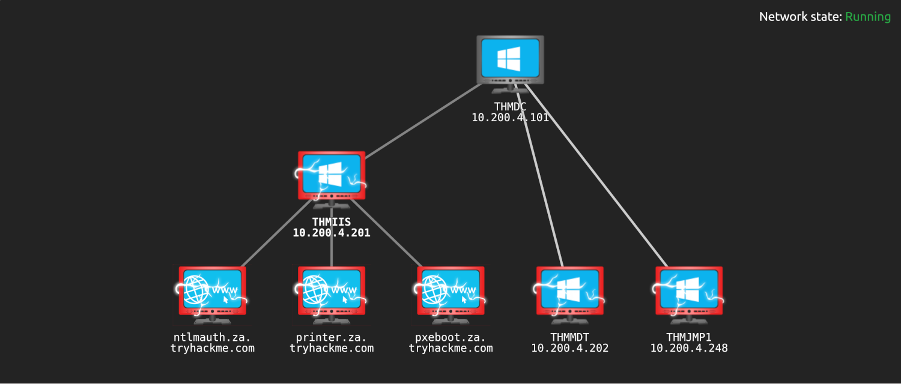

# Introduction

| 
|:--:|
| [THM Room: Breaching Active Directory](https://tryhackme.com/room/breachingad) |

## What?

Acquire an initial set of valid Active Directory (AD) credentials for a way to authenticate to AD, allowing further enumeration on AD. 

## Why?

To be able to exploit AD misconfigurations for privilege escalation, lateral movement, and goal execution.

## How?

The attack surface for gaining an initial set of credentials is usually significant. This is by no means an 
exhaustive list:

* [NTLM authenticated services](ntlm.md)
* [LDAP bind credentials](ldap.md)
* [Authentication relays](relays.md)
* [Microsoft Deployment Toolkit](mdt.md)
* [Configuration files](config.md)
