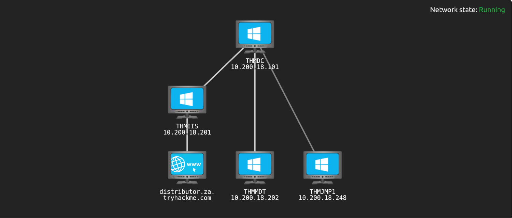

# Introduction

| 
|:--:|
| [THM Room: Enumerating Active Directory](https://tryhackme.com/room/adenumeration) |

## What?

Enumerate details about the AD setup and structure with authenticated access, even super low-privileged access. 

## Why?

Finding some way to escalate privileges or move laterally to gain additional access until we have enough privileges 
to execute and reach our goals.

## How?

* [Setup for THM AD](setup.md)
* [Credential injection](injection.md)
* [Through Microsoft Management Console](mmc.md)
* [Through Command Prompt](cmd.md)
* [Through PowerShell](powershell.md)
* [Through Bloodhound](bloodhound.md)
* [Cleanup](cleanup.md)
