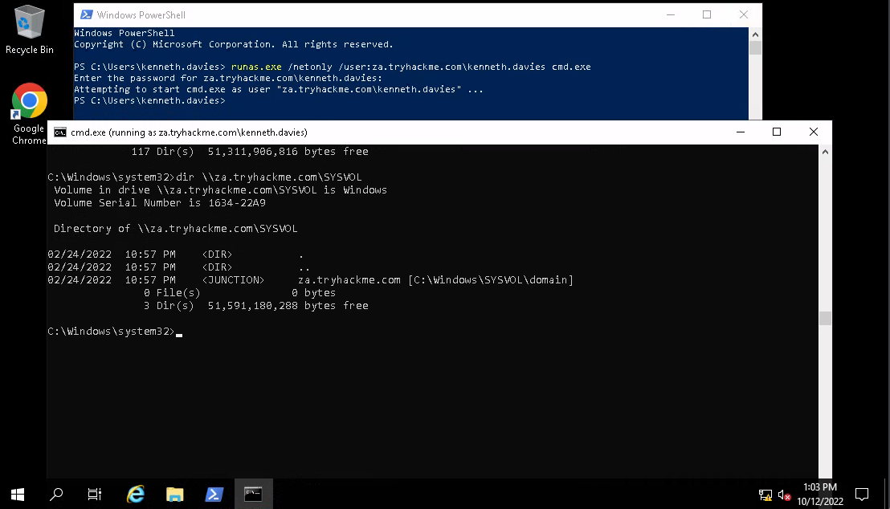

# Credential injection

There may be Active Directory credentials when we've landed a foothold on an unjoined host. We could try 
to use the network session to enumerate `SYSVOL` on the domain controller

    runas.exe /netonly /user:domain.tld\username cmd.exe

* `/netonly` - use the credentials for network sessions only, all other commands run in the current user session 
on the local host
* `/user` - the user we want to authenticate as in network sessions
* `cmd.exe` spawn a new command prompt window with the injected network credential

And enumerate `SYSVOL`:

```text
dir \\za.tryhackme.com\SYSVOL
```

|  |
| :--: |
| Enumerating SYSVOL |
