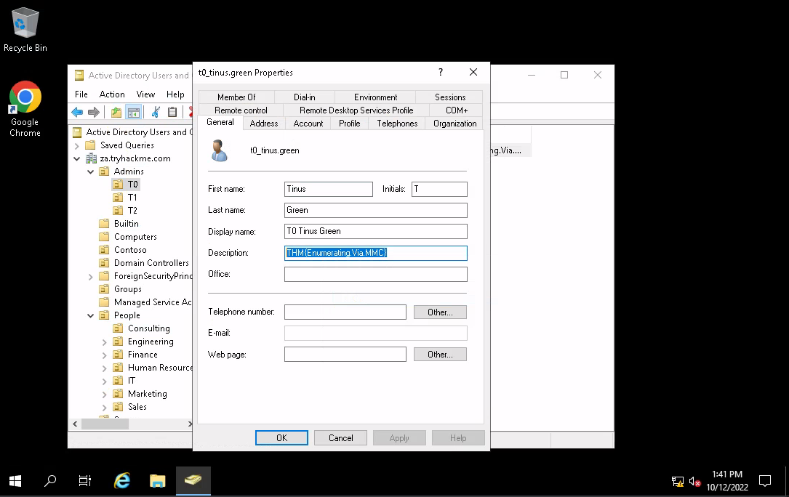

# Through Microsoft Management Console

The jump host is already joined to the domain, so when using the jump host, there is no need for enabling `RSAT` or 
changing the forest and domain.

Use either `ssh` or `RDP` and get to it:

|  |
| :--: |
| Tinus green |