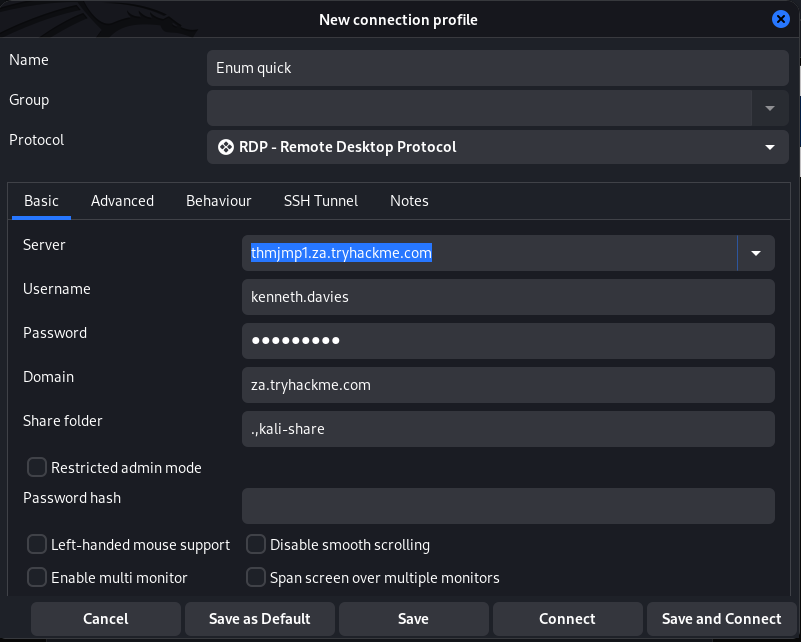

# Setup for THM AD

Download the vpn config file from THM, and use it to configure 

    sudo openvpn --config ./<username>-adenumeration.ovpn --daemon

Check PID (you get a number, if not, doesn't work):

    sudo ps aux | grep -v grep | grep -i <username>-adenumeration.ovpn | awk -v FS=' ' '{print $2}'

Set your DNS IPv4 to the IP address of the THMDC in the network diagram, and run:

    sudo systemctl restart NetworkManager

Test:

    nslookup thmdc.za.tryhackme.com

Get your credentials from `http://distributor.za.tryhackme.com/creds`.

You can now either login with `ssh`, for example:

    $ ssh kenneth.davies@za.tryhackme.com@thmjmp1.za.tryhackme.com 
    ...
    kenneth.davies@za.tryhackme.com@thmjmp1.za.tryhackme.com's password: 
    
    Microsoft Windows [Version 10.0.17763.1098]
    (c) 2018 Microsoft Corporation. All rights reserved.

Or by RPD:

|  |
|:--:|
| The kali-share drive mounts the current working directory as a network drive  in the RDP session, for uploading and downloading files. |

