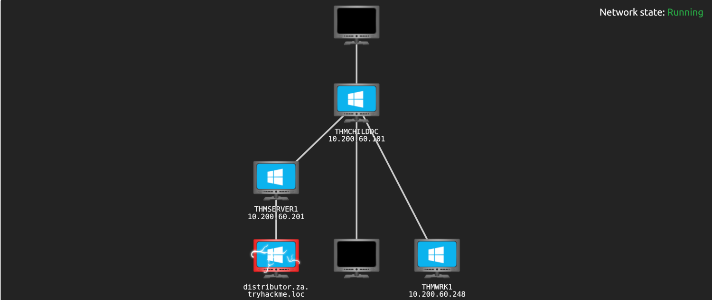

# Introduction

| 
|:--:|
| [THM Room: Exploiting Active Directory](https://tryhackme.com/room/exploitingad) |

## What?

Common AD exploitation techniques. A combination of lateral movement and privilege escalation.

## Why?

Reaching a suitable position to execute goals.

## How?

* [Setup for THM AD](setup.md)
* [Exploiting permission delegation](permissions.md)
* [Exploiting kerberos delegation](kerberos.md)
* [Exploiting automated relays](relays.md)
* [Exploiting AD users](users.md)
* [Exploiting GPOs](gpos.md)
* [Exploiting certificates](certificates.md)
* [Exploiting domain trusts](trusts.md)
